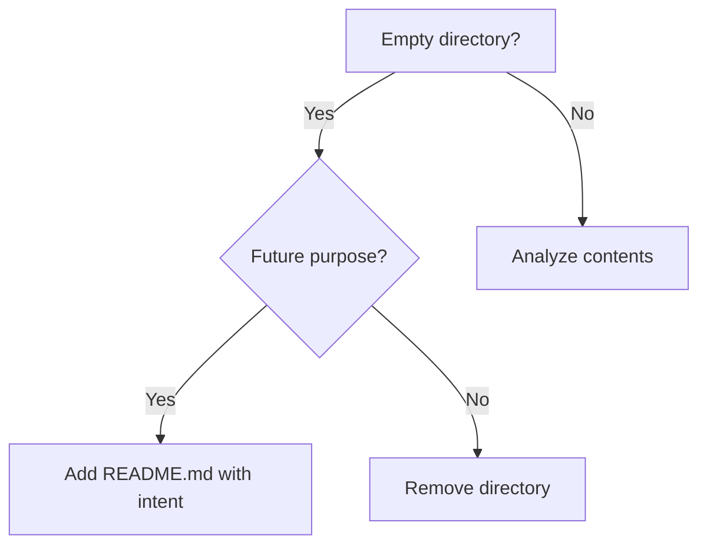

# Purpose

Reorganize directory structures systematically while maintaining separation of concerns, documenting decisions, and preserving git history.

## Instructions

### Prerequisites

Read these files to understand the project structure:
- `CLAUDE.md` — Repository structure and standards
- `docs/standards/state-management.md` — How state directories work
- [checklist.md](checklist.md) — Pre-flight checklist for reorganizations

### When to Use This Skill

| Trigger | Example |
|---------|---------|
| "clean up" | "Clean up the omar/ directory" |
| "reorganize" | "Reorganize the project structure" |
| "restructure" | "Restructure admin/ for better clarity" |
| "merge folders" | "Merge these two directories" |
| "split directory" | "Split this directory into separate concerns" |
| "simplify structure" | "Simplify the folder hierarchy" |

### Workflow

#### Step 1: Analyze Current State

```bash
# Check git status for pending changes
git status

# List current structure
tree <target-directory> -L 3

# Check for files vs empty directories
find <target-directory> -type f
find <target-directory> -type d -empty
```

**Questions to answer:**
- What files exist? What's their purpose?
- Are there empty directories? Should they stay or go?
- Are there pending git changes affecting this area?

#### Step 2: Define Target State

Before making changes, clearly define:

| Current | Target | Rationale |
|---------|--------|-----------|
| `path/from/` | `path/to/` or DELETE | Why this change |

**Apply separation of concerns:**
- **Identity** (who) vs **Functions** (how) vs **Work** (what)
- Personal context ≠ Administrative systems ≠ Project work

#### Step 3: Check References

Search for references to files being moved/deleted:

```bash
# Find references in CLAUDE.md files
grep -r "target-path" . --include="CLAUDE.md"

# Find references in any markdown
grep -r "target-path" . --include="*.md"
```

Update references BEFORE or AFTER the move (document which approach).

#### Step 4: Execute Changes

**For deletions:**
```bash
git rm path/to/file.md
```

**For moves:**
```bash
git mv path/from path/to
```

**For new placeholder files:**
```bash
# Create README for empty directories with future intent
cat > path/to/README.md << 'EOF'
# Directory Name

**Status**: Placeholder
**Purpose**: [Future intent description]

Not yet populated. Keep for future use.
EOF
```

#### Step 5: Verify

```bash
# Check git status
git status

# Verify structure
tree <target-directory>

# Test any @ references in CLAUDE.md
# (manual verification)
```

#### Step 6: Commit

Use conventional commit format:

```bash
git commit -m "chore(scope): brief description

- Change 1
- Change 2
- Change 3"
```

### Best Practices

| Do | Don't |
|----|-------|
| Document intent for empty directories | Leave empty dirs without explanation |
| Update references before committing | Leave broken @ references |
| One logical change per commit | Mix unrelated reorganizations |
| Preserve git history with `git mv` | Delete and recreate files |
| Ask user about unclear directories | Assume and delete |

### Common Patterns

#### Pattern 1: Empty Directory Decision



#### Pattern 2: Separation Check

| Question | If YES → | If NO → |
|----------|----------|---------|
| Is it about WHO someone is? | `{user}/context/` | Continue |
| Is it a system/process? | `admin/` | Continue |
| Is it client work? | `projects/` | Continue |
| Is it learning material? | `learning/` | Other |

## Examples

### Example 1: Clean Up User Directory

User request:
```
Clean up the omar/ directory - it has empty folders and over-engineered state management
```

You would:

1. Analyze current state:
   ```bash
   tree omar/ -a
   git status omar/
   ```

2. Identify changes:
   - `omar/context/state/` → DELETE (over-engineered)
   - `omar/model/` (empty) → ADD README with intent
   - `omar/tools/` (empty) → ADD README with intent

3. Check references:
   ```bash
   grep -r "omar/" . --include="CLAUDE.md"
   ```
   → Found: `@omar/context/README.md` — must keep

4. Execute:
   ```bash
   git rm -r omar/context/state/
   echo "# Omar Model\n\n**Status**: Placeholder" > omar/model/README.md
   echo "# Omar Tools\n\n**Status**: Placeholder" > omar/tools/README.md
   ```

5. Commit:
   ```bash
   git add .
   git commit -m "chore(omar): clean up directory structure"
   ```

### Example 2: Merge Two Directories

User request:
```
Merge admin/scheduling/ into admin/time/
```

You would:

1. Check both directories exist and their contents
2. Verify no naming conflicts
3. Move files:
   ```bash
   git mv admin/scheduling/* admin/time/
   rmdir admin/scheduling
   ```
4. Update any references
5. Commit with clear message

## Summary

Directory reorganization is about:
1. **Clarity** — Structure matches mental model
2. **Documentation** — Intent is clear for future instances
3. **Preservation** — Git history maintained, references updated
4. **Atomicity** — One logical change at a time

Use the [checklist](checklist.md) before every reorganization.
