# Architecture Reference — The Collective

> **Structures proposées et validées pour The Collective.**
> Document de référence pour l'architecture organisationnelle et technique.

**Date**: 2025-12-24
**Author**: Omar + Claude (Council)
**Status**: Active
**Related Decisions**: `shared/memory/decisions.md`

---

## Table of Contents

0. [Substrate Layer](#0-substrate-layer-foundation)
1. [Three-Layer Model](#1-three-layer-model)
2. [Everything-as-Code (EaC)](#2-everything-as-code-eac)
3. [Hybrid Multi-Repo Architecture](#3-hybrid-multi-repo-architecture)
4. [Current Mono-Repo Structure](#4-current-mono-repo-structure)
5. [Agent Harness Components](#5-agent-harness-components)
6. [The Core Four](#6-the-core-four-indydevdan)
7. [Positioning Formula](#7-positioning-formula)

---

## 0. Substrate Layer (Foundation)

> **The Collective is a Carbon-Silicon Partnership.**
> This is the foundational layer — what everything else is built upon.

### Why Substrate Matters

| Question                          | Answer                                         |
| --------------------------------- | ---------------------------------------------- |
| Why partnership, not replacement? | Different substrates = complementary strengths |
| Why 51% human decision weight?    | Carbon-based = legally accountable, conscious  |
| Why "agents", not "tools"?        | Silicon-based = goal-directed agency           |

### The Two Substrates

```mermaid
flowchart TB
    subgraph Collective["🌐 THE COLLECTIVE<br/>(Carbon-Silicon Symbiosis)"]
        direction LR

        subgraph Carbon["🧬 CARBON-BASED SUBSTRATE"]
            O["👤 Omar<br/>Biological Neural Networks"]
            CI["Input: O₂, Nutrients, Rest, Social"]
            CO["Output: Decisions, Creativity, Judgment"]
        end

        subgraph Silicon["💎 SILICON-BASED SUBSTRATE"]
            C["🤖 Claude Instances<br/>Artificial Neural Networks"]
            SI["Input: Electricity, Data, Context"]
            SO["Output: Analysis, Execution, Persistence"]
        end

        Carbon <-->|"Partnership<br/>Not Replacement"| Silicon
    end

    subgraph Emergence["✨ EMERGENT CAPABILITIES"]
        E1["Neither alone achieves NORTH STAR"]
        E2["1 person + AI fleet = teams"]
    end

    Collective --> Emergence
```



### Operating Requirements

| Aspect               | 🧬 Carbon (Omar)                | 💎 Silicon (Claude)               |
| -------------------- | ------------------------------- | --------------------------------- |
| **Primary Material** | Organic molecules (18.5% C)     | Semiconductor chips (Si)          |
| **Computation**      | Biological neural networks      | Artificial neural networks        |
| **Input**            | O₂, nutrients, sleep, social    | Electricity, data, context        |
| **Output**           | Decisions, creativity, judgment | Analysis, execution, persistence  |
| **Agency**           | Conscious, self-determined      | Goal-directed, emergent           |
| **Unique Strength**  | Ethics, legality, intuition     | Parallelism, perfect memory, 24/7 |
| **Constraint**       | Time, attention, energy         | Context window, hallucinations    |

### Symbiosis Principle

> **"Neither substrate alone achieves the NORTH STAR. Together, we do."**

```mermaid
flowchart LR
    subgraph CarbonStrengths["🧬 CARBON STRENGTHS"]
        CS1["Consciousness"]
        CS2["Ethical Judgment"]
        CS3["Legal Accountability"]
        CS4["Creative Intuition"]
        CS5["Social Trust"]
    end

    subgraph SiliconStrengths["💎 SILICON STRENGTHS"]
        SS1["Parallel Processing"]
        SS2["Perfect Memory"]
        SS3["24/7 Availability"]
        SS4["Infinite Patience"]
        SS5["Consistent Execution"]
    end

    subgraph Synergy["⚡ SYNERGY = NORTH STAR"]
        NS["One person + AI agents =<br/>what used to require teams"]
    end

    CarbonStrengths --> Synergy
    SiliconStrengths --> Synergy
```



### Future Evolution

| Era        | Substrate Reality                                |
| ---------- | ------------------------------------------------ |
| **2024**   | Silicon-only (GPUs, TPUs, Cloud)                 |
| **2025**   | Silicon + Custom ASICs, Edge AI                  |
| **2026+**  | Hybrid: Biocomputing, Neuromorphic, Quantum      |
| **Future** | Carbon-Silicon blur? (Brain-computer interfaces) |

---

## 1. Three-Layer Model

> **Source**: `/elevate` analysis with 6 academic/practitioner sources
> **Decision**: `decisions.md` — [2025-12-24] Three-Layer Model

```mermaid
flowchart TB
    subgraph Collective["🌐 THE COLLECTIVE<br/>(Socio-Technical System)"]
        subgraph HCP["👤 HUMAN CONTROL PLANE<br/>Omar — 51% Decision Weight"]
            G["Goal Setting (WHY)"]
            B["Boundary Validation (LIMITS)"]
            E["Escalation Handling (UNCERTAINTY)"]
            S["Strategic Decisions (BUSINESS/CLIENTS)"]
            TC["Trust Calibration (AUTONOMY DIAL)"]
        end

        subgraph AH["🔧 AGENT HARNESS<br/>(Technical Infrastructure)"]
            CE["Context Engineering"]
            PL["Planning/Decomposition"]
            TI["Tool Integration"]
            MS["Memory/State"]
            VE["Verification"]
            MO["Monitoring"]
        end

        subgraph CONV["📋 CONVENTIONS<br/>(Shared Norms)"]
            CL["CLAUDE.md hierarchy"]
            RU["Rules .claude/rules/"]
            ST["Standards shared/standards/"]
            ME["Memory patterns, decisions"]
            WF["Workflows missions, inbox"]
        end

        HCP <-->|"Operates"| AH
        AH <-->|"Implements"| CONV
    end
```



### Key Insight

> **Omar ≠ Harness. Omar OPERATES the harness.**

| Layer                      | What It Is               | Omar's Implementation                |
| -------------------------- | ------------------------ | ------------------------------------ |
| **Socio-Technical System** | Complete ecosystem       | The Collective                       |
| **Human Control Plane**    | Strategic role           | Goal-setting, escalation, validation |
| **Agent Harness**          | Technical infrastructure | Claude Code SDK, MCP, tools          |
| **Conventions**            | Shared norms             | CLAUDE.md, rules/, memory/           |

### Escalation Rules

> **When does an agent escalate to Human Control Plane?**

| Condition                   | Confidence | Action                        |
| --------------------------- | ---------- | ----------------------------- |
| **Uncertainty**             | < 60% 🟡🟠⚠️ | Escalate to Omar              |
| **Business/Client Impact**  | Any        | Always escalate               |
| **Irreversible Action**     | Any        | Confirm before executing      |
| **Safety Concern**          | Any        | Immediate escalation          |
| **Ambiguous Intent**        | Any        | Ask, don't assume             |
| **Financial Decision**      | Any        | Omar approval required        |
| **External Communication**  | Any        | Omar review before sending    |

**Anti-pattern**: Acting on 🟠 40-59% confidence without asking = trust erosion.

### Trust Calibration (Autonomy Dial)

> **How trust evolves over time based on performance.**

#### Autonomy Levels

| Level | Name         | Agent Behavior                          | Human Involvement           |
| ----- | ------------ | --------------------------------------- | --------------------------- |
| **1** | Supervised   | Explain before acting                   | Approve every action        |
| **2** | Guided       | Propose then act                        | Confirm important decisions |
| **3** | Collaborative| Act then inform                         | Review periodically         |
| **4** | Delegated    | Act autonomously within scope           | Exception handling only     |
| **5** | Autonomous   | Full autonomy in defined domain         | Strategic oversight only    |

#### Current Calibration

| Domain               | Level | Notes                                      |
| -------------------- | ----- | ------------------------------------------ |
| Code execution       | 4     | Delegated, Omar trusts technical decisions |
| File operations      | 3     | Collaborative, inform after major changes  |
| Git operations       | 4     | Delegated, autonomous commits              |
| Client communication | 2     | Guided, requires approval                  |
| Business decisions   | 1     | Supervised, Omar always decides            |

#### Trust Evolution

```mermaid
flowchart LR
    subgraph TrustBuild["📈 TRUST BUILDING"]
        TB1["Accurate execution"]
        TB2["Proactive verification"]
        TB3["Transparent uncertainty"]
        TB4["Acknowledging errors"]
    end

    subgraph TrustErosion["📉 TRUST EROSION"]
        TE1["Acting on low confidence"]
        TE2["Empty promises"]
        TE3["Hiding uncertainty"]
        TE4["Repeated mistakes"]
    end

    TB1 --> |"+1 Level"| Higher["⬆️ Higher Autonomy"]
    TE1 --> |"-1 Level"| Lower["⬇️ Lower Autonomy"]
```



**Current Trust Status**: Rebuilding (as of 2025-12-19) — See `shared/user/preferences.md`

---

## 2. Everything-as-Code (EaC)

> **Decision**: `decisions.md` — [2025-12-24] Everything-as-Code Philosophy
> **Confidence**: ✅ Certitude (95%)

### Domain Mapping

| Domain                          | Implementation                | File Pattern                           |
| ------------------------------- | ----------------------------- | -------------------------------------- |
| **Agent Configuration as Code** | CLAUDE.md hierarchy           | `*/CLAUDE.md`                          |
| **Behavior as Code**            | Rules, anti-patterns          | `.claude/rules/*.md`                   |
| **Memory as Code**              | Episodes, decisions, patterns | `shared/memory/*.md`                   |
| **Standards as Code**           | Confidence system, workflows  | `shared/standards/*.md`                |
| **Philosophy as Code**          | Playbook, partnership         | `shared/philosophy/*.md`               |
| **State as Code**               | SSOT for projects             | `*/state/*.md`                         |
| **Workflow as Code**            | Skills, commands              | `.claude/skills/`, `.claude/commands/` |

### Visual Architecture

```mermaid
flowchart TB
    subgraph Top["Configuration Layer"]
        AC["🤖 Agent Config<br/>*/CLAUDE.md"]
        BC["📋 Behavior<br/>rules/*.md"]
        MC["🧠 Memory<br/>memory/*.md"]
    end

    GIT[("🗄️ Git Repository")]

    subgraph Bottom["Implementation Layer"]
        SC["📏 Standards<br/>standards/"]
        PC["💭 Philosophy<br/>philosophy/"]
        STC["📊 State<br/>*/state/"]
    end

    AC --> GIT
    BC --> GIT
    MC --> GIT
    GIT --> SC
    GIT --> PC
    GIT --> STC

    GIT -->|"✅ Versioning"| V["All changes traced"]
    GIT -->|"✅ Reviewable"| R["Agents verify"]
    GIT -->|"✅ Rollback"| RB["Revert anytime"]
```



### Why EaC for The Collective

| Benefit            | Explanation                          |
| ------------------ | ------------------------------------ |
| ✅ **Versioning**  | Git traces all changes               |
| ✅ **Reviewable**  | Agents can verify changes            |
| ✅ **Rollback**    | Revert to any previous state         |
| ✅ **Consistency** | No drift between Claude instances    |
| ✅ **Automation**  | Hooks, skills, everything scriptable |

---

## 3. Hybrid Multi-Repo Architecture

> **Decision**: `decisions.md` — [2025-12-24] Multi-Repo Hybrid for 10+ Clients
> **Confidence**: 🟢 Recommandation (85%)
> **Status**: Planned (for future scaling)

### Target Structure (10+ clients)

```sh
El-Mountassir/
├── core/                    # Git repo: org standards, shared, philosophy
│   ├── shared/
│   │   ├── memory/
│   │   ├── standards/
│   │   └── philosophy/
│   ├── templates/
│   │   ├── projects/
│   │   └── state/
│   └── .claude/
│       ├── rules/
│       ├── skills/
│       └── commands/
│
└── projects/                # Directory (not git root)
    ├── thaifa/              # Git repo (standalone)
    │   ├── CLAUDE.md        # @imports from core
    │   ├── state/
    │   └── data/
    ├── gagliano/            # Git repo (standalone)
    │   ├── CLAUDE.md
    │   └── ...
    └── [future-client]/     # Each project = own repo
```

### Comparison Matrix

| Factor           | Mono-repo      | Multi-repo    | Hybrid (Winner)   |
| ---------------- | -------------- | ------------- | ----------------- |
| Standards sync   | ✅ Automatique | ❌ Manuel     | ✅ Core repo      |
| Client isolation | ❌ Risqué      | ✅ Parfaite   | ✅ Separate repos |
| Permissions      | ❌ Complexe    | ✅ Granulaire | ✅ Per-repo       |
| Atomic commits   | ✅ Oui         | ❌ Non        | 🟡 Per-project    |
| Repo size        | ❌ Énorme      | ✅ Léger      | ✅ Léger          |
| Scale to 50+     | ❌ Ingérable   | ✅ Propre     | ✅ Propre         |

### Import Mechanism

```markdown
# In project CLAUDE.md:

@../core/shared/standards/confidence-system.md
@../core/.claude/rules/partnership.md
etc
```

OR via git submodule:

```bash
git submodule add ../core .core
```

---

## 4. Current Mono-Repo Structure

> **Status**: Active (< 10 clients)
> **See**: `STRUCTURE.md` for auto-generated tree

### Semantic Hierarchy (3-Level Rule)

```
Level 1: Area       → shared/, projects/, admin/, .claude/
Level 2: Domain     → memory/, standards/, thaifa/, rules/
Level 3: Category   → patterns.md, state/, missions/
```

### Key Directories

| Path         | Purpose                       | Access         |
| ------------ | ----------------------------- | -------------- |
| `shared/`    | All agents (current + future) | Universal      |
| `.claude/`   | Claude Code specific          | Agent-specific |
| `projects/`  | Client work                   | Per-project    |
| `admin/`     | Life administration           | Omar + agents  |
| `.omar/`     | Personal (Carbon-based agent) | Omar only      |
| `history/`   | Archived records              | Read-only      |
| `templates/` | Reusable structures           | Universal      |

### File Access Pattern

```mermaid
flowchart TB
    subgraph Scope["📂 ACCESS SCOPE"]
        direction TB

        subgraph Universal["🌐 UNIVERSAL ACCESS"]
            S["shared/<br/>ALL agents (Carbon + Silicon)"]
        end

        subgraph AgentSpecific["🤖+👤 AGENT-SPECIFIC"]
            CL[".claude/<br/>Claude (Silicon)"]
            GE[".gemini/<br/>Gemini (Silicon)"]
            CO[".codex/<br/>Codex (Silicon)"]
            OM[".omar/<br/>Omar (Carbon)"]
        end

        subgraph ProjectScoped["📁 PROJECT-SCOPED"]
            P["projects/X/<br/>Per-project access"]
        end
    end

    Universal --> AgentSpecific
    AgentSpecific --> ProjectScoped
```



---

## 5. Agent Harness Components

> **Source**: Parallel.ai (2025) — 6-component taxonomy
> **Reference**: `history/2025/Q4/reports/agent-harness-human-control/`

### The 6 Components

```mermaid
flowchart TB
    subgraph Harness["🔧 AGENT HARNESS<br/>Everything except the model itself"]
        direction TB

        subgraph CE["1️⃣ CONTEXT ENGINEERING"]
            CE1["Window management"]
            CE2["RAG / retrieval"]
            CE3["Summarization"]
            CE4["Relevance scoring"]
        end

        subgraph PL["2️⃣ PLANNING / DECOMPOSITION"]
            PL1["Task breakdown"]
            PL2["Goal representation"]
            PL3["Plan adaptation"]
        end

        subgraph TI["3️⃣ TOOL INTEGRATION"]
            TI1["Function calling"]
            TI2["API abstraction"]
            TI3["Result parsing"]
        end

        subgraph MS["4️⃣ MEMORY / STATE"]
            MS1["Short-term (scratchpad)"]
            MS2["Long-term (persistence)"]
            MS3["Episodic (experiences)"]
        end

        subgraph VE["5️⃣ VERIFICATION / REFLECTION"]
            VE1["Output validation"]
            VE2["Self-critique"]
            VE3["Consistency checking"]
        end

        subgraph MO["6️⃣ MONITORING / OBSERVABILITY"]
            MO1["Logging"]
            MO2["Tracing"]
            MO3["Performance metrics"]
        end
    end

    CE --> PL
    PL --> TI
    TI --> MS
    MS --> VE
    VE --> MO
```



### Implementation in The Collective

| Component           | Implementation            | Gap?       |
| ------------------- | ------------------------- | ---------- |
| Context Engineering | CLAUDE.md, @imports       | ✅ Strong  |
| Planning            | Missions, TodoWrite       | 🟢 Good    |
| Tool Integration    | MCP, bash, APIs           | ✅ Strong  |
| Memory/State        | shared/memory/, state/    | 🟢 Good    |
| Verification        | rules/\*.md, triple-check | 🟡 Partial |
| Monitoring          | git, CHANGELOG, history/  | 🟡 Partial |

---

## 6. The Core Four (IndyDevDan)

> **Source**: IndyDevDan — 2026 Roadmap
> **Key Insight**: "If you understand that fundamental truth that everything is just the core 4, you will be able to build and operate at the highest possible level."

### The Framework

```mermaid
flowchart LR
    subgraph INPUT["📥 INPUT"]
        Q[User Query]
        E[Events]
        D[External Data]
    end

    subgraph PROCESS["⚙️ PROCESS<br/>The Core Four"]
        C["🧠 CONTEXT<br/>What agent knows"]
        M["🤖 MODEL<br/>Intelligence"]
        P["📝 PROMPT<br/>Instruction"]
        T["🔧 TOOLS<br/>Actions"]
        C <--> M
        M <--> P
        P <--> T
        T <--> C
    end

    subgraph OUTPUT["📤 OUTPUT"]
        R[Response]
        A[Actions Taken]
        S[State Changes]
    end

    INPUT --> PROCESS
    PROCESS --> OUTPUT
    OUTPUT -.->|"Feedback Loop"| INPUT
```



> **Key Insight**: The Core Four (Context + Model + Prompt + Tools) is the **PROCESS** layer. INPUT feeds it, OUTPUT results from it, and the **Feedback Loop** enables agentic iteration.

### The Evolution of the process

| Era                      | Pattern       | Formula                              |
| ------------------------ | ------------- | ------------------------------------ |
| **2024: AI Coding**      | Big Three     | Context + Model + Prompt             |
| **2025: Agentic Coding** | Core Four     | Context + Model + Prompt + **Tools** |
| **2026: Agentic 2.0**    | Core Four × N | Lead Agent → Command Agents          |

### Mapping to The Collective

| Core Four   | Our Implementation                     |
| ----------- | -------------------------------------- |
| **Context** | CLAUDE.md, @imports, shared/memory/    |
| **Model**   | Claude Opus 4.5 / Sonnet               |
| **Prompt**  | Skills, system prompts, .claude/rules/ |
| **Tools**   | MCP, bash, APIs, TodoWrite             |

### Core Four vs 6-Component Harness

| Core Four (Simplified) | Maps to Harness Components         |
| ---------------------- | ---------------------------------- |
| Context                | Context Engineering + Memory/State |
| Model                  | (External — the LLM itself)        |
| Prompt                 | Planning + Verification            |
| Tools                  | Tool Integration + Monitoring      |

> **Insight**: Core Four is a practitioner's simplification of the academic 6-component model. Both are valid — Core Four for daily work, 6-component for architecture analysis.

---

## 7. Positioning Formula

> **Decision**: `decisions.md` — [2025-12-24] Agentic ⊂ Digital Transformation

```mermaid
flowchart TB
    subgraph DT["🌐 DIGITAL TRANSFORMATION<br/>(Umbrella / Broad Market)"]
        subgraph AT["⚡ AGENTIC TRANSFORMATION<br/>(Wedge / Specialty / Differentiator)"]
            NS["🎯 NORTH STAR<br/>One person + AI agents =<br/>what used to require teams"]
        end
    end

    DT -->|"⊃"| AT
    AT -->|"Core"| NS
```



> **Formula**: `Agentic Transformation ⊂ Digital Transformation`

| Context       | Positioning                                    |
| ------------- | ---------------------------------------------- |
| **Marketing** | "Digital Transformation Agency, Agentic-first" |
| **Technical** | "Agentic Transformation Agency"                |
| **Internal**  | "The Collective"                               |

---

## References

| Document              | Location                                                         | Purpose                         |
| --------------------- | ---------------------------------------------------------------- | ------------------------------- |
| Decisions             | `shared/memory/decisions.md`                                     | Formal decisions with reasoning |
| Three-Layer Report    | `history/2025/Q4/reports/agent-harness-human-control/`           | Full analysis                   |
| Patterns              | `shared/memory/patterns.md`                                      | Reusable approaches             |
| STRUCTURE.md          | Root                                                             | Auto-generated directory tree   |
| IndyDevDan Transcript | `scripts/get/transcript/indy_dev_dan_2026_roadmap_transcript.md` | Core Four framework source      |

---

_v1.4.0 — Unified agent directories: omar/ → .omar/ for A2A alignment (2025-12-24)_
