# Process Documentation

> **The Collective's operational processes.**
> How work flows through the system — complements [architecture/](../architecture/) (WHAT) with HOW.

---

## Purpose

| Folder           | Focus     | Question Answered                  |
| ---------------- | --------- | ---------------------------------- |
| `architecture/`  | Structure | WHAT is the system?                |
| **`processes/`** | **Flow**  | **HOW does work move through it?** |
| `guides/`        | Tasks     | HOW TO do specific things?         |

---

## Framework

This documentation uses two complementary frameworks:

### Leeds University Multi-Level Documentation

| Level | Name          | Purpose                        | We Use For          |
| ----- | ------------- | ------------------------------ | ------------------- |
| **0** | Organization  | Structure overview             | See `architecture/` |
| **1** | Process Map   | Dependencies between processes | Overview diagrams   |
| **2** | Process Model | Task flow sequence             | Main documentation  |
| **3** | Task Details  | Granular steps                 | Inline when needed  |

> **Source**: [University of Leeds — A Practical Guide to Documenting and Designing Processes](https://deliveringresults.leeds.ac.uk/a-practical-guide-to-documenting-and-designing-processes/)

### SIPOC Framework

Every process document follows the **SIPOC** structure:

```mermaid
flowchart LR
    S["🔵 Suppliers<br/>Who provides inputs?"]
    I["🟢 Inputs<br/>What goes in?"]
    P["🟡 Process<br/>What happens?"]
    O["🟠 Outputs<br/>What comes out?"]
    C["🔴 Customers<br/>Who receives outputs?"]

    S --> I --> P --> O --> C
```



| Component     | Question                       | Example (Mission)                              |
| ------------- | ------------------------------ | ---------------------------------------------- |
| **S**uppliers | Who provides the inputs?       | Omar, Claude Web, session insights             |
| **I**nputs    | What goes into the process?    | Mission spec, context, objectives              |
| **P**rocess   | What are the steps?            | CREATE → ASSIGN → EXECUTE → COMPLETE → ARCHIVE |
| **O**utputs   | What does the process produce? | Deliverables, decisions, learnings             |
| **C**ustomers | Who benefits from outputs?     | Omar, future Claude instances, The Collective  |

---

## Documents

| Document                                     | Process                               | Status    |
| -------------------------------------------- | ------------------------------------- | --------- |
| [mission-lifecycle.md](mission-lifecycle.md) | Mission management (CREATE → ARCHIVE) | REFERENCE |
| [session-flow.md](session-flow.md)           | Session start/end (/start → /end)     | REFERENCE |
| [decision-making.md](decision-making.md)     | Confidence-based decisions            | REFERENCE |

---

## How to Read Process Docs

Each document contains:

1. **SIPOC Overview** — Visual diagram of the full flow
2. **Suppliers** — Who/what provides inputs
3. **Inputs** — What the process requires
4. **Process** — State diagram + transitions + detailed steps
5. **Outputs** — What the process produces
6. **Customers** — Who benefits

### When to Use Each Level

| Need            | Use     | Document Section                      |
| --------------- | ------- | ------------------------------------- |
| Quick overview  | Level 1 | SIPOC Overview diagram                |
| Understand flow | Level 2 | Process section + state diagram       |
| Detailed steps  | Level 3 | Subsections (e.g., Claiming Protocol) |

---

## Relationship to Other Documentation

```
docs/reference/
├── architecture/          ← WHAT the system IS (conceptual)
│   ├── architecture.md    # 8 sections of structure
│   ├── evaluation.md      # Scoring report
│   └── backlog.md         # Improvement tracker
│
├── processes/             ← HOW the system WORKS (operational) ← YOU ARE HERE
│   ├── README.md          # This file
│   ├── mission-lifecycle.md
│   ├── session-flow.md
│   └── decision-making.md
│
├── guides/                ← HOW TO do specific tasks (instructional)
│   ├── claude-code-chrome.md
│   └── ...
│
└── drafts/
    └── c4-model.md        # Software structure (future)
```

---

## Adding New Process Documentation

1. **Identify the process** — What operational flow needs documenting?
2. **Create file** — `{process-name}.md` in this folder
3. **Use SIPOC structure** — Follow the template below
4. **Add Mermaid diagrams** — Visual state/flow diagrams
5. **Update this README** — Add to Documents table
6. **Update INDEX.md** — Add to Processes section

### Template

```markdown
# {Process Name} Process

> Brief description of what this process does.

---

## SIPOC Overview

[Mermaid diagram showing S→I→P→O→C]

---

## Suppliers

| Supplier | Role | Contribution |
| -------- | ---- | ------------ |
| ...      | ...  | ...          |

---

## Inputs

| Input | Source | Format |
| ----- | ------ | ------ |
| ...   | ...    | ...    |

---

## Process

[Mermaid state diagram]

### State Transitions

| Current | Actor | Action | Next |
| ------- | ----- | ------ | ---- |
| ...     | ...   | ...    | ...  |

---

## Outputs

| Output | Location | Format |
| ------ | -------- | ------ |
| ...    | ...      | ...    |

---

## Customers

| Customer | Benefit |
| -------- | ------- |
| ...      | ...     |

---

## References

- Related architecture section
- Related standards
```

---

## Future Processes to Document

| Process             | Priority | Notes                        |
| ------------------- | -------- | ---------------------------- |
| Client onboarding   | P3       | When client projects scale   |
| Git workflow        | P4       | Branching, commits, PRs      |
| Documentation cycle | P5       | How docs get created/updated |

---

_Created: 2025-12-23_
_Framework: Leeds University + SIPOC_
