# Decision Making Process

> **Confidence-based decision flow: Evaluate → Decide → Record**
> Ensures appropriate escalation and documented reasoning.

---

## SIPOC Overview

```mermaid
flowchart LR
    subgraph S["🔵 SUPPLIERS"]
        S1["Any agent"]
        S2["Context/situation"]
        S3["Prior decisions"]
    end

    subgraph I["🟢 INPUTS"]
        I1["Options"]
        I2["Constraints"]
        I3["Confidence level"]
        I4["Domain context"]
    end

    subgraph P["🟡 PROCESS"]
        P1["1. Assess confidence"]
        P2["2. Check escalation"]
        P3["3. Decide or ask"]
        P4["4. Record"]
    end

    subgraph O["🟠 OUTPUTS"]
        O1["Decision record"]
        O2["Action taken"]
        O3["Reasoning documented"]
    end

    subgraph C["🔴 CUSTOMERS"]
        C1["Omar"]
        C2["All agents"]
        C3["Future instances"]
    end

    S --> I --> P --> O --> C
```



---

## Suppliers

| Supplier | Role | Contribution |
| -------- | ---- | ------------ |
| **Any Agent** | Decision maker | Identifies need for decision |
| **Context** | Situational information | Options, constraints, requirements |
| **Prior Decisions** | Historical reference | `shared/memory/decisions.md` patterns |
| **Standards** | Guidelines | Confidence system, escalation rules |

---

## Inputs

| Input | Source | Purpose |
| ----- | ------ | ------- |
| **Options** | Analysis | Available choices |
| **Constraints** | Context | Limitations, requirements |
| **Confidence Level** | Self-assessment | How certain am I? |
| **Domain** | Task context | Which autonomy level applies? |
| **Escalation Rules** | Architecture | When to ask Omar |

---

## Process

### Decision Flow

```mermaid
flowchart TB
    START["Decision needed"]

    subgraph Assess["📊 ASSESS CONFIDENCE"]
        A1["What is my confidence?"]
        A2["✅ ≥95% Certitude"]
        A3["🟢 80-94% Recommandation"]
        A4["🟡 60-79% Intuition"]
        A5["🟠 40-59% Hypothèse"]
        A6["⚠️ <40% Speculation"]
    end

    subgraph Check["🔍 CHECK ESCALATION"]
        C1["Is this business/client?"]
        C2["Is this irreversible?"]
        C3["Is this financial?"]
        C4["Is this external comms?"]
    end

    subgraph Action["⚡ ACTION"]
        ACT["Act autonomously"]
        INFORM["Act, then inform"]
        PROPOSE["Propose, wait for confirmation"]
        ASK["Ask before acting"]
        STOP["Don't act, gather info"]
    end

    subgraph Record["📝 RECORD"]
        R1["Document in decisions.md"]
        R2["Include reasoning"]
        R3["Note confidence level"]
    end

    START --> Assess
    A2 --> ACT
    A3 --> INFORM
    A4 --> PROPOSE
    A5 --> ASK
    A6 --> STOP

    Assess --> Check
    Check -->|"Any YES"| ASK

    ACT --> Record
    INFORM --> Record
    PROPOSE --> Record
    ASK --> Record
```



### Confidence → Action Mapping

| Confidence | Level | Indicator | Agent Behavior |
| ---------- | ----- | --------- | -------------- |
| **≥95%** | Very High | ✅ | Act autonomously |
| **80-94%** | High | 🟢 | Act, then inform Omar |
| **60-79%** | Medium | 🟡 | Propose, wait for confirmation |
| **40-59%** | Low | 🟠 | Ask before acting |
| **<40%** | Very Low | ⚠️ | Don't act, gather more information |

### Escalation Rules

> **Reference**: [architecture.md Section 1 — Escalation Rules](../architecture/architecture.md#escalation-rules)

| Condition | Confidence | Action |
| --------- | ---------- | ------ |
| **Uncertainty** | < 60% 🟡🟠⚠️ | Escalate to Omar |
| **Business/Client Impact** | Any | Always escalate |
| **Irreversible Action** | Any | Confirm before executing |
| **Safety Concern** | Any | Immediate escalation |
| **Ambiguous Intent** | Any | Ask, don't assume |
| **Financial Decision** | Any | Omar approval required |
| **External Communication** | Any | Omar review before sending |

**Anti-pattern**: Acting on 🟠 40-59% confidence without asking = trust erosion.

### Domain-Based Autonomy

> **Reference**: [architecture.md Section 1 — Trust Calibration](../architecture/architecture.md#trust-calibration-autonomy-dial)

| Domain | Current Level | Behavior |
| ------ | ------------- | -------- |
| Code execution | Level 4 (Delegated) | Act autonomously within scope |
| File operations | Level 3 (Collaborative) | Act then inform |
| Git operations | Level 4 (Delegated) | Autonomous commits |
| Client communication | Level 2 (Guided) | Propose then act |
| Business decisions | Level 1 (Supervised) | Explain before acting |

---

## Outputs

| Output | Location | Format |
| ------ | -------- | ------ |
| **Decision Record** | `shared/memory/decisions.md` | Structured entry |
| **Action Taken** | Various | Implementation |
| **Reasoning** | In decision record | Explanation |
| **Confidence Noted** | In decision record | Level indicator |

### Decision Record Format

```markdown
### [YYYY-MM-DD] Decision Title

**Context**: Why this decision was needed
**Options Considered**:
1. Option A — pros/cons
2. Option B — pros/cons

**Decision**: What was decided
**Confidence**: 🟢 85% (High)
**Reasoning**: Why this option was chosen
**Author**: Agent name or Omar
```

---

## Customers

| Customer | Benefit | How They Consume |
| -------- | ------- | ---------------- |
| **Omar** | Appropriate escalation, no surprises | Informed on important decisions |
| **Current Agent** | Clear action path | Knows what to do at each confidence level |
| **Future Agents** | Decision history | Read `decisions.md` for context |
| **The Collective** | Consistent decision-making | Pattern emerges over time |

---

## Decision Categories

### Strategic Decisions (Omar ALWAYS decides)

```mermaid
flowchart LR
    subgraph Strategic["🎯 STRATEGIC (Omar 100%)"]
        S1["Business direction"]
        S2["Client relationships"]
        S3["Financial commitments"]
        S4["Legal matters"]
        S5["Public statements"]
    end

    S1 & S2 & S3 & S4 & S5 --> OMAR["👤 OMAR DECIDES"]
```



### Technical Decisions (Agent can decide)

```mermaid
flowchart LR
    subgraph Technical["🔧 TECHNICAL (Agent if ≥80%)"]
        T1["Implementation approach"]
        T2["Tool selection"]
        T3["Code structure"]
        T4["File organization"]
    end

    T1 & T2 & T3 & T4 --> AGENT["🤖 AGENT DECIDES<br/>(then informs)"]
```



### Operational Decisions (Confidence-based)

```mermaid
flowchart TB
    subgraph Operational["⚙️ OPERATIONAL"]
        O1["Process improvements"]
        O2["Documentation updates"]
        O3["Workflow changes"]
    end

    O1 & O2 & O3 --> ASSESS["Assess confidence"]
    ASSESS --> |"≥80%"| ACT["Act, inform"]
    ASSESS --> |"60-79%"| PROPOSE["Propose, confirm"]
    ASSESS --> |"<60%"| ASK["Ask first"]
```



---

## Trust Evolution

```mermaid
flowchart LR
    subgraph Build["📈 BUILDS TRUST"]
        B1["Accurate decisions"]
        B2["Transparent uncertainty"]
        B3["Proactive escalation"]
        B4["Good judgment calls"]
    end

    subgraph Erode["📉 ERODES TRUST"]
        E1["Acting on low confidence"]
        E2["Missing escalation triggers"]
        E3["Surprising Omar"]
        E4["Not documenting reasoning"]
    end

    Build --> UP["⬆️ Higher Autonomy"]
    Erode --> DOWN["⬇️ Lower Autonomy"]
```



**Current Trust Status**: Rebuilding (as of 2025-12-19)

---

## References

- **Standard**: [shared/standards/confidence-system.md](../../../shared/standards/confidence-system.md)
- **Architecture**: [architecture.md Section 1](../architecture/architecture.md#1-three-layer-model)
- **Memory**: [shared/memory/decisions.md](../../../shared/memory/decisions.md)
- **User Preferences**: [shared/user/preferences.md](../../../shared/user/preferences.md)

---

_Created: 2025-12-23_
_Framework: Leeds Level 2 + SIPOC_
