# Mission Lifecycle Process

> **Multi-step work packages flow: CREATE → ASSIGN → EXECUTE → COMPLETE → ARCHIVE**
> The primary operational process for The Collective.

---

## SIPOC Overview

```mermaid
flowchart LR
    subgraph S["🔵 SUPPLIERS"]
        S1["Omar (Goals)"]
        S2["Claude Web (Research)"]
        S3["Claude Code (Execution)"]
        S4["Session Insights"]
    end

    subgraph I["🟢 INPUTS"]
        I1["Mission Spec"]
        I2["Context Files"]
        I3["Objectives"]
        I4["Success Criteria"]
    end

    subgraph P["🟡 PROCESS"]
        P1["1. Draft"]
        P2["2. Queue"]
        P3["3. Claim"]
        P4["4. Execute"]
        P5["5. Archive"]
    end

    subgraph O["🟠 OUTPUTS"]
        O1["Deliverables"]
        O2["Decisions"]
        O3["Learnings"]
        O4["Documentation"]
    end

    subgraph C["🔴 CUSTOMERS"]
        C1["Omar"]
        C2["Future Claude"]
        C3["The Collective"]
    end

    S --> I --> P --> O --> C
```



---

## Suppliers

| Supplier | Role | Contribution |
| -------- | ---- | ------------ |
| **Omar El Mountassir** | Human operator, strategic decision-maker | Identifies strategic needs, approves missions, adjusts scope, evaluates outputs |
| **Claude Web** | Research & analysis agent | Prepares mission specs, conducts investigation, provides recommendations |
| **Claude Code** | Execution agent | Recognizes execution opportunities, creates missions from learnings |
| **Session Insights** | Contextual emergence | Issues discovered during work, patterns identified, blockers encountered |
| **Collective Learning** | Accumulated knowledge | Lessons from archived missions inform new mission design |

---

## Inputs

| Input | Source | Format | Example |
| ----- | ------ | ------ | ------- |
| **Mission Spec** | Omar or Claude Web | Markdown + YAML frontmatter | `templates/missions/mission.md` |
| **Context/Background** | History, conversation | Natural language | "Omar needs booking pages for clients" |
| **Objectives** | Strategic intent | Bulleted checklist | "Create 30-min and 60-min booking slots" |
| **Success Criteria** | Business requirements | Verification table | "Booking page live and accessible" |
| **Constraints** | Operational limits | Bulleted list | "Use Chrome MCP, UTC+1 timezone" |
| **Priority** | Omar's judgment | P0-P3 scale | P1 = high, ready soon |
| **Type** | Classification | Enum | STANDARD, ELEVATE, FIX, FEATURE, RESEARCH, MIGRATION |
| **Assignment** | Omar decision | Agent name | "Claude Code", "Claude Web", "Omar" |

---

## Process

### State Diagram


### State Transitions

| Current State | Location | Actor | Action | Next State | Evidence |
| ------------- | -------- | ----- | ------ | ---------- | -------- |
| **DRAFT** | `missions/drafts/` | Omar, Claude Web | Write spec | → QUEUED | Filename: `{slug}.md` |
| **QUEUED** | `missions/queue/` | Omar | Assign to agent | → ACTIVE | Filename: `{YYYY-MM-DD}-{slug}.md` |
| **ACTIVE** | `missions/active/` | Assigned agent | Claiming protocol | → COMPLETED | `claimed_at`, `claimed_by` in YAML |
| **COMPLETED** | `missions/active/` | Agent | Verify all criteria | → ARCHIVED | Evidence table filled |
| **ARCHIVED** | `history/YYYY/QQ/missions/{slug}/` | Agent | Final documentation | (closed) | 3-file structure |

### Claiming Protocol (Level 3 Detail)

> **Problem**: Multiple Claude instances can unknowingly work on the same mission.
> **Solution**: Filesystem location IS the claim.


| Step | Command/Action | Purpose |
| ---- | -------------- | ------- |
| **CHECK** | `ls missions/active/` | See if someone is working |
| **MOVE** | `mv queue/{mission}.md active/` | Filesystem = claim |
| **UPDATE** | Set `claimed_at`, `claimed_by` in YAML | Metadata for audit |
| **LOG** | First entry: "CLAIMED by [session]" | Audit trail |
| **WORK** | Begin execution | Start the mission |

### Conflict Detection

| Condition | Action |
| --------- | ------ |
| `active/` empty | Safe to claim from queue |
| `active/` not empty, claimed < 24h | Another instance working — ask user |
| `active/` not empty, claimed > 24h | May be abandoned — ask user to resume or reassign |

### Quality Gates (Before Archival)

```markdown
Pre-Archive Checklist:
- [ ] All success criteria have evidence (✅ or documented reason)
- [ ] Execution log is complete (append-only, no gaps)
- [ ] Deviations documented (what changed, why)
- [ ] Lessons learned captured (rules to extract, patterns to add)
- [ ] Files in correct archive location (history/YYYY/QQ/missions/{slug}/)
```

---

## Outputs

| Output | Location | Format | Content |
| ------ | -------- | ------ | ------- |
| **Mission Document** | `history/YYYY/QQ/missions/{slug}/mission.md` | Markdown + YAML | Final spec with status & evidence |
| **Execution Log** | `history/YYYY/QQ/missions/{slug}/execution-log.md` | Append-only log | Timestamped actions, decisions |
| **Deviations Record** | `history/YYYY/QQ/missions/{slug}/deviations.md` | Documented differences | What changed and why |
| **Lessons Learned** | In mission.md | Markdown section | What to do differently |
| **Direct Deliverables** | Varies | Context-dependent | Files created, features built |
| **Collective Learning** | `shared/memory/*.md` | Updated entries | Decisions, patterns, facts |

---

## Customers

| Customer | Benefit | How They Consume |
| -------- | ------- | ---------------- |
| **Omar El Mountassir** | Completed work, business value | Immediately usable deliverables |
| **Future Claude Code** | Context continuity, patterns | Read execution log, archived missions |
| **Future Claude Web** | Decision context | Read decisions.md, patterns.md |
| **The Collective** | Accumulated knowledge | Shared memory grows, standards improve |
| **New Agents** | Onboarding context | CLAUDE.md references, examples |

---

## Example Flow

### Google Calendar Booking Pages Mission (2025-12-23)

```mermaid
flowchart LR
    subgraph Flow["📋 ACTUAL FLOW"]
        A["SUPPLIER<br/>Omar identified need"] --> B["INPUT<br/>Session insight"]
        B --> C["CREATE<br/>Mission spec"]
        C --> D["ASSIGN<br/>Queued (P1)"]
        D --> E["EXECUTE<br/>Omar manual config"]
        E --> F["COMPLETE<br/>6/6 criteria ✅"]
        F --> G["ARCHIVE<br/>history/2025/Q4/"]
    end

    subgraph Output["📤 OUTPUTS"]
        O1["2 booking URLs"]
        O2["Updated preferences.md"]
        O3["Client communication pattern"]
    end

    G --> Output
```



---

## References

- **Standard**: [shared/standards/management/missions/README.md](../../../shared/standards/management/missions/README.md)
- **Template**: [templates/missions/mission.md](../../../templates/missions/mission.md)
- **Architecture**: [architecture.md Section 1 (Three-Layer Model)](../architecture/architecture.md#1-three-layer-model)
- **Memory**: [shared/memory/](../../../shared/memory/) for decisions, patterns, facts

---

_Created: 2025-12-23_
_Framework: Leeds Level 2 + SIPOC_
