# Session Flow Process

> **Claude Code session lifecycle: /start → Work → /end**
> Ensures context continuity and prevents premature closure.

---

## SIPOC Overview

```mermaid
flowchart LR
    subgraph S["🔵 SUPPLIERS"]
        S1["User (Omar)"]
        S2["External triggers"]
        S3["Previous sessions"]
    end

    subgraph I["🟢 INPUTS"]
        I1["CLAUDE.md context"]
        I2["Mission state"]
        I3["Git status"]
        I4["Session history"]
    end

    subgraph P["🟡 PROCESS"]
        P1["1. /start"]
        P2["2. Orient"]
        P3["3. Work"]
        P4["4. Capture"]
        P5["5. /end"]
    end

    subgraph O["🟠 OUTPUTS"]
        O1["Deliverables"]
        O2["Commits"]
        O3["Mission progress"]
        O4["Learnings captured"]
    end

    subgraph C["🔴 CUSTOMERS"]
        C1["Omar"]
        C2["Future instances"]
        C3["The Collective"]
    end

    S --> I --> P --> O --> C
```

---

## Suppliers

| Supplier | Role | Contribution |
| -------- | ---- | ------------ |
| **Omar** | Session initiator | Provides goals, context, direction |
| **External Triggers** | Events | Notifications, deadlines, client requests |
| **Previous Sessions** | Context | Execution logs, decisions, patterns |
| **System State** | Environment | Git status, file state, mission status |

---

## Inputs

| Input | Source | Purpose |
| ----- | ------ | ------- |
| **CLAUDE.md** | Repository root | Primary context, rules, standards |
| **Active missions** | `missions/active/` | Work in progress |
| **Queued missions** | `missions/queue/` | Ready for assignment |
| **Git status** | Repository | Uncommitted changes |
| **Inbox** | `admin/inbox/pending.md` | Items needing Omar's attention |
| **Session memory** | `shared/memory/` | Decisions, patterns, facts |

---

## Process

### State Diagram

### /start Flow (Session Initialization)

```mermaid
flowchart TB
    START["/start command"]

    subgraph Checks["📋 INITIALIZATION CHECKS"]
        C1["Check missions/active/<br/>Is someone working?"]
        C2["Check missions/queue/<br/>What's ready?"]
        C3["Check git status<br/>Clean or dirty?"]
        C4["Check inbox<br/>Pending items?"]
    end

    subgraph Summary["📊 STATE SUMMARY"]
        S1["Display active missions"]
        S2["Display queue count"]
        S3["Show git status"]
        S4["Show pending inbox items"]
    end

    subgraph Ask["❓ ORIENTATION"]
        A1["Resume active mission?"]
        A2["Claim from queue?"]
        A3["New initiative?"]
    end

    START --> Checks --> Summary --> Ask
```

| Check | Condition | Action |
| ----- | --------- | ------ |
| `active/` not empty | Mission in progress | Warn, ask: resume or reassign? |
| `active/` empty, `queue/` has items | Work available | Offer to claim |
| Git dirty | Uncommitted changes | Display status |
| Inbox has items | Pending questions | Remind Omar |

### Work Loop

### /end Flow (Session Closure)

| Guardrail | Condition | Action |
| --------- | --------- | ------ |
| **Uncaptured items** | Tasks mentioned but no mission created | **BLOCK** — Create mission first |
| **Git dirty** | Uncommitted changes exist | **BLOCK** — Commit or stash first |
| **CHANGELOG** | Changes made but not logged | **WARN** — Recommend updating |
| **Learnings** | Patterns discovered but not documented | **WARN** — Recommend capturing |

---

## Outputs

| Output | Destination | Format |
| ------ | ----------- | ------ |
| **Deliverables** | Various | Files, commits, configurations |
| **Commits** | Git repository | Conventional commit messages |
| **Mission progress** | Execution logs | Timestamped entries |
| **Captured learnings** | `shared/memory/` | Decisions, patterns, facts |
| **Inbox updates** | `admin/inbox/pending.md` | Items for Omar |
| **Session summary** | Chat | Overview of work done |

---

## Customers

| Customer | Benefit | How They Consume |
| -------- | ------- | ---------------- |
| **Omar** | Work completed, context preserved | Immediate deliverables, session summary |
| **Future Claude instances** | Continuity | Execution logs, memory files, clean git state |
| **The Collective** | Accumulated knowledge | Memory files grow, patterns documented |

---

## Key Principles

### HARD STOP #6: No Premature Closure

> **NEVER say "session complete" without capturing ALL remaining items as missions.**
> Even minor/non-blocking items must be captured.

**Background**: Prevents repeat of 2025-12-21 incident where session ended with items lost.
See: `LESSONS-LEARNED/2025-12-21-premature-closure.md`

### Instance Handoff

```mermaid
flowchart LR
    subgraph Session1["📍 SESSION 1"]
        S1A["Work on mission"]
        S1B["Context limit reached"]
        S1C["Log stopping point"]
    end

    subgraph Handoff["🤝 HANDOFF"]
        H1["Execution log preserved"]
        H2["YAML state updated"]
        H3["Git committed"]
    end

    subgraph Session2["📍 SESSION 2"]
        S2A["/start"]
        S2B["Read execution log"]
        S2C["Continue work"]
    end

    Session1 --> Handoff --> Session2
```

---

## References

- **Skill**: [.claude/skills/starting-session/SKILL.md](../../../.claude/skills/starting-session/SKILL.md)
- **Skill**: [.claude/skills/ending-session/SKILL.md](../../../.claude/skills/ending-session/SKILL.md)
- **Lesson**: [LESSONS-LEARNED/2025-12-21-premature-closure.md](../../../LESSONS-LEARNED/2025-12-21-premature-closure.md)
- **CLAUDE.md**: Session handling section

---

_Created: 2025-12-23_
_Framework: Leeds Level 2 + SIPOC_
